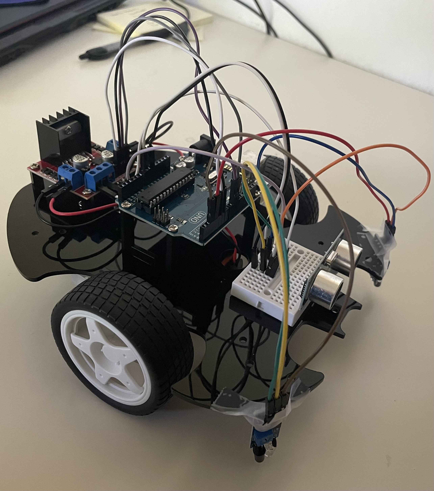

# Edge Detecting Idle Table Rover
I have used the versatile 3 - in - 1 sunfounder kit to construct and edge detecting free roam robot. It's fairly simple, using an arduino, two motors, a motor driver, and 2 IR sensors to work. Specifically throughout building this project, the IR sensors were especially annoying.

| **Engineer** | **School** | **Area of Interest** | **Grade** |
|:--:|:--:|:--:|:--:|
| Jack M | Purdue University | Mechanical Engineering | Incoming Junior

  
# Potential Challenges

1. Assembly
- The base can appear symmetrical
- Th stand offs can occasionally be tricky and threading may not be fully there
- Enure to insert the screws facing the correct direction when attaching the motor to avoid interference with wheels

2. Electrical/Sensors

- For motor driver, do not use the 5V output pin and instead power the driver directly from the Vin pin
- Angle of IR sensors in Sunfounder's given instructions is abysmal for what we are trying to do
- Messing with the potentiometer built into the IR sensor is necessary
- Set up the mini breadboard to distribute power to all necessary components

3. Code
- Set up an individual method for stopping, reverse, turning, etc.
- Tinker with time delays to prevent jerky movement
- Make sure it turns the correct way depending on which sensor gets triggered

# In-kit Mods
The kit comes with a crazy amount of additional parts and the base project is fairly simple so I expect multiple modifications per student.

1. Addition of ultrasonic sensor
- Adding an Ultrasonic sensor could prevent running into walls
- Attaching Ultrasonic to servo could allow for fuller view

2. Joystic control
- Adding the joystick will allow students to actually physicall control the rover
- Gives students a better understanding of map() function through dual potentiometer

3. Line tracking
- A new way to get the rover to follow a path
- Kind of the same thing as IR but still new sensor, new student experience

4. IOT connection
- Allows students to get an idea of how to connect an Arduino to wifi through use of the ESP8266
- Gives an idea of how inputs travel wirelessly
- Once again same appeal as joystick, controlling your own rover

# Out-of-kit Mods

1. Better IR sensors
- Would just make the thing more reliable and easy to use

2. Adafruit LED strip
- I'm always partial to LEDs and I think specificallt the controllable strips work very well and look very cool
- Can be integrated to flash a color when edge is detected

3. Any other information gathering sensor(temperature, humidity, light) + LCD screen
- Allows a student to integrate two new peices
- LCD can display the information from sensor

4. CAD design a chassis (personal favorite)
- Allows a student to learn CAD and understand 3D printing
- Could be a challenge depending on availability of 3D printers and how fast the parts get shipped to the student

